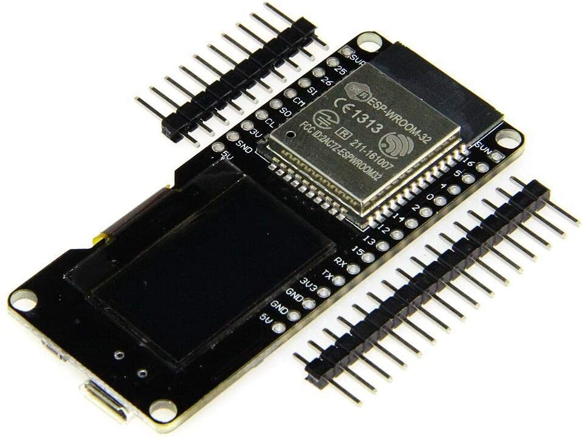

# Hydroponic 水耕栽培
This project was launched for Hydroponics.  
And the code in this project has been tested with MicroPython on ESP32 board.  

このプロジェクトは、水耕栽培用に立ち上げたものです。  
また、プロジェクト動作確認は ESP32 ボード上の MicroPython で行いました。  

## Overview 概要
This project is MicroPython and is created by introducing PyMakr into Visual Studio Code.  
And the platform is ESP32 board, OLED SSD1306 for using to display the acquired informations, and other measuring device used are BME280 and DS18B20.  

このプロジェクトは MycroPython で Visual Studio Code に PyMakr を導入して作成しています。  
プラットフォームは ESP32 ボードで、取得したデータ表示に SSD1306 を使用し、その他の計測デバイスは BME280 と DS18B20 です。  

The icon at startup is vertically, and the temperature display is in degrees Celsius.  
It is efficient to build a development environment to change.  
If the development environment has not been built, please build it while referring to the reference site or other.  

起動時のアイコン表示は縦方向、温度は摂氏表示、となっています。  
これを変更するには、開発環境を構築すると効率的です。  
もし開発環境が未構築の場合は、Web サイト等を参照しながら構築してみてください。  

* Reference 参考  
    * [[備忘録]ESP32-VSCode-microPythonでの開発環境の構築 - Qiita](https://qiita.com/kotaproj/items/b53006aef9d04053a5ee) (Japanese)  

## Hardware ハードウェア

### ESP32 board with OLED SSD1306
  
  

* Reference 参考  
  * [SSD1306 | Solomon Systech Limited](https://www.solomon-systech.com/en/product/advanced-display/oled-display-driver-ic/ssd1306/) (OFFICIAL English)  

OLED SSD1306 is OLED driver IC from SOLOMON SYSTECH.  
For this time used OLED is connected with I2C interface to the ESP32 board.  
The resolution is 128 x 64 and it is used as the display destination of the acquired informations.  

OLED SSD1306 は SOLOMON SYSTECH 社が提供する OLED ドライバです。  
今回の OLED は ESP32 ボードに I2C インターフェースで接続している ESP32 ボードです。  
また解像度が 128 x 64 で、取得した情報の表示先として使用しています。  

### BME280
  

* Reference 参考  
  * [Humidity Sensor BME280 | Bosch Sensortec](https://www.bosch-sensortec.com/products/environmental-sensors/humidity-sensors-bme280/) (OFFICIAL English)  
  * [BME280 – スイッチサイエンス](http://trac.switch-science.com/wiki/BME280) (Japanese)  

BME280 is a multi-function sensor from BOSCH that can measure temperature, humidity and atmospheric pressure.  
And it is connected with I2C interface.  

BME280 は BOSCH 社が提供する多機能センサーで 温度・湿度・大気圧 を計測できるマルチセンサーです。  
I2C インターフェースで接続しています。  

### DS18B20
]  

* Reference 参考  
  * [DS18B20 Programmable Resolution 1-Wire Digital Thermometer - Maxim Integrated](https://www.maximintegrated.com/en/products/sensors/DS18B20.html/tb_tab0) (OFFICIAL English)  
  * [DS18B20 プログラマブル分解能1-Wireデジタルサーモメータ - Maxim Integrated](https://www.maximintegrated.com/jp/products/sensors/DS18B20.html) (OFFICIAL Japanse)  
  * [Interfacing the DS18X20/DS1822 1-Wire® Temperature Sensor in a Microcontroller Environment](https://www.maximintegrated.com/en/design/technical-documents/app-notes/1/162.html) (OFFICIAL English)  
  * [マイクロコントローラ環境における1-Wire&reg;温度センサDS18X20/DS1822とのインタフェース](https://www.maximintegrated.com/jp/design/technical-documents/app-notes/1/162.html) (OFFICIAL Japanese)  
  * [Quick reference for the ESP32 — MicroPython 1.13 documentation](http://docs.micropython.org/en/latest/esp32/quickref.html#onewire-driver) (English)  
  * [ESP32 用クイックリファレンス — MicroPython 1.13 ドキュメント](https://micropython-docs-ja.readthedocs.io/ja/latest/esp32/quickref.html#onewire-driver) (Japanese)  

DS18B20 is a thermistor device from Maxim.  
And it is connected with 1-Wire interface and uses a warterproof product.  

DS18B20 は MAXIM 社が提供するサーミスタデバイスです。  
1-Wire インターフェースで接続しており、防水された製品を使用しています。  

## Installation 導入方法

This time, we will use esptool to the following steps.  

ここでは、esptool と ampy を使った導入手順を例示します。  

* Reference 参考  
  * [Getting started with MicroPython on the ESP32 — MicroPython 1.13 documentation](http://docs.micropython.org/en/latest/esp32/tutorial/intro.html) (OFFICIAL English)  
  * [ESP32 での MicroPython の始め方 — MicroPython 1.13 ドキュメント](https://micropython-docs-ja.readthedocs.io/ja/latest/esp32/tutorial/intro.html) (Japanese)  
  * [GitHub - espressif/esptool: Espressif SoC serial bootloader utility](https://github.com/espressif/esptool/) (English)  
  * [GitHub - scientifichackers/ampy: Adafruit MicroPython Tool - Utility to interact with a MicroPython board over a serial connection.](https://github.com/scientifichackers/ampy) (English)  
  * [ESP32でesptool.pyの使い方 – Lang-ship](https://lang-ship.com/blog/work/esp32-esptool-py/) (Japanese)  
  * [ampy: MicroPythonマイコンとPCとのファイル転送ツール – Ambient](https://ambidata.io/blog/2018/03/15/ampy/) (Japanese)  

### (steps in English)
1. Connect the ESP32 board and each devices.  
   Refer to following figure, you connect the devices according to the pin definition on the ESP32 board.  
     

   If the pin definition is different, you need to change the program "main.py".  

1. Install the firmware of MicroPython to the ESP32 board  

    1. At first, you connect the ESP32 board and your PC with a MicroUSB Cable, and it is start to the following works.  

    1. Next, you download the firmware from MicroPython official download site.  
    [MicroPython - Python for microcontrollers](https://micropython.org/download/esp32/)  

    1. Next, you erase the flash memory on the ESP32 board.  
       Change connection port name and baud rate according to your environment.  
        ```bash
        esptool.py --chip esp32 --port COM3 --baud 921600 erase_flash
        ```

    1. Next, you put on the firmware of MicroPython to the ESP32 board.  
       This time, I used esp32-idf3-20200902-v1.13 for ESP-IDF v3.x as the firmware.  
        ```bash
        esptool.py --chip esp32 --port COM3 --baud 921600 write_flash 0x001000 esp32-idf3-20200902-v1.13.bin
        ```

1. Install this project files to the ESP32 board  

    1. At first, you download this project files from GitHub repository.  
        ```bash
        git clone https://github.com/ks-tec/hydroponic.git
        ```

    1. Next, you put on the download files to the ESP32 board.  
        ```bash
        cd hydroponic
        ampy --port COM3 mkdir lib
        ampy --port COM3 mkdir resource
        ampy --port COM3 put lib/bme280.py /lib/bme280.py
        ampy --port COM3 put lib/ds18.py /lib/ds18.py
        ampy --port COM3 put lib/ssd1306.py /lib/ssd1306.py
        ampy --port COM3 put lib/waterlevel.py /lib/waterlevel.py
        ampy --port COM3 put resource/splashicon.py /resource/splashicon.py
        ampy --port COM3 put main.py
        ampy --port COM3 put hydroponic.json
        ```

    1. Check put files, and there is no problem if it is as follows.
        ```bash
        ampy --port COM3 ls
          /boot.py
          /hydroponic.json
          /lib
          /main.py
          /resource

        ampy --port COM3 ls /lib
          /lib/bme280.py
          /lib/ds18.py
          /lib/ssd1306.py
          /lib/waterlevel.py

        ampy --port COM3 ls /resource
          /resource/splashicon.py
        ```

    1. Next, you run program on the ESP32 board.  
        ```bash
        ampy --port COM3 run main.py
        ```

#### (steps in Japanese)
1. ESP32 ボードと各デバイスを配線します。  
   下図を参考に、ESP32 ボードのピン定義に合わせて接続してください。  
     

   ESP32 ボードのピン定義が異なる場合は、プログラム main.py の変更が必要になります。  

1. MicroPython を導入します。  

    1. ESP32 ボードと PC を MicroUSB ケーブルで繋いだら、作業を開始します。  

    1. MicroPython 公式サイトからファームウェアをダウンロードします。  
    [MicroPython - Python for microcontrollers](https://micropython.org/download/esp32/)  

    1. ESP32 ボード上のフラッシュを消去します。  
       接続されているポート番号やボーレートは、環境に合わせて変更してください。
        ```bash
        esptool.py --chip esp32 --port COM3 --baud 921600 erase_flash
        ```

    1. ESP32 ボードに MicroPython のファームウェアを書き込みます。  
       今回は ファームウェアに ESP-IDF v3.x 向けの esp32-idf3-20200902-v1.13 を使いました。  
        ```bash
        esptool.py --chip esp32 --port COM3 --baud 921600 write_flash 0x001000 esp32-idf3-20200902-v1.13.bin
        ```

1. このプロジェクトを導入します。  

    1. GitHub からダウンロードします。  
        ```bash
        git clone https://github.com/ks-tec/hydroponic.git
        ```

    1. ESP32 ボードに このプロジェクトを書き込みます。  
        ```bash
        cd hydroponic
        ampy --port COM3 mkdir lib
        ampy --port COM3 mkdir resource
        ampy --port COM3 put lib/bme280.py /lib/bme280.py
        ampy --port COM3 put lib/ds18.py /lib/ds18.py
        ampy --port COM3 put lib/ssd1306.py /lib/ssd1306.py
        ampy --port COM3 put lib/waterlevel.py /lib/waterlevel.py
        ampy --port COM3 put resource/splashicon.py /resource/splashicon.py
        ampy --port COM3 put main.py
        ampy --port COM3 put hydroponic.json
        ```

    1. 配置したファイル群を確認して、以下のようになっていれば問題ありません。  
        ```bash
        ampy --port COM3 ls
          /boot.py
          /hydroponic.json
          /lib
          /main.py
          /resource

        ampy --port COM3 ls /lib
          /lib/bme280.py
          /lib/ds18.py
          /lib/ssd1306.py
          /lib/waterlevel.py

        ampy --port COM3 ls /resource
          /resource/splashicon.py
        ```

    1. ESP32 ボード上でプロジェクトを実行します。
        ```bash
        ampy --port COM3 run main.py
        ```

## Usage 使用方法
When you connect the ESP32 board to the power supply, the measurement starts automatically.  
Or, When you want restart, you rerun the program already placed on the ESP32 board.  

Change connection port name according to your environment.  

ESP32 ボードと電源を繋ぐと、自動的に計測が始まります。  
または、再起動したい場合は、ESP32 ボード上に配置済みのプログラムを再実行します。  

接続されているポート番号は、環境に合わせて変更してください。  

```bash
ampy --port COM3 run main.py
```

## What has been and will be これまでのこと、これからのこと
I am NOT good at Python language, but rather just getting started and having fun learning.  
Still, I have made it this far.  

私は Python が得意ではなく、むしろ触れ始めたばかりで楽しみながら学んでいるところす。  
それでも、ここまで進んで来られました。

And also, a simple capacitive water level detection was implemented using Touch Pins.  
If the water level can be detected, automatic water supply according to water level will be possible through relay control.  

Ultimately, I aim for all-weather hydroponics using LED lights.  

また、タッチピンを使用して簡易的なな静電容量方式の水位検出を実装しました。  
水位検出を行えれば、リレー制御を通じて水位に応じた自動給水ができるでしょう。  

最終的には、LED 光を利用した全天候型の水耕栽培を目指しています。  

## Note 注意事項
The contents of this project may be updated without notice. Please be aware.  

このプロジェクトの内容は、予告なく更新される場合があります。 ご承知おきください。  

## Change log 更新履歴

### 1.1.1
DS18 reading wait time was added to settings.  

DS18 からのデータ読取の待機時間を設定ファイルに追加しました。  

### 1.1.0
The setting values was put out to an external file "hydroponic.json".  
And also, water level dection was easily implemented using Touch Pin.  

And I changed the directory structure to make it easier to understand the function of each file.  

設定値を外部ファイル "hydroponic.json" に切り出しました。  
また、タッチピンを使用して水位検知を簡易的に実装しました。  

そして、ファイル毎の機能を把握しやすいようにディレクトリ構造を変更しました。    

### 1.0.0
First released.  
The platform is ESP32 board, and using devices are OLED SSD1306, DS18B20, BME280.  

最初のリリースです。  
プラットフォームはESP32ボードで、使用デバイスはOLED SSD1306、DS18B20、BME280です。  


## License ライセンス
This project is under [MIT license](https://en.wikipedia.org/wiki/MIT_License).  
Copyright (c) 2020, [ks-tec](https://github.com/ks-tec/).  
