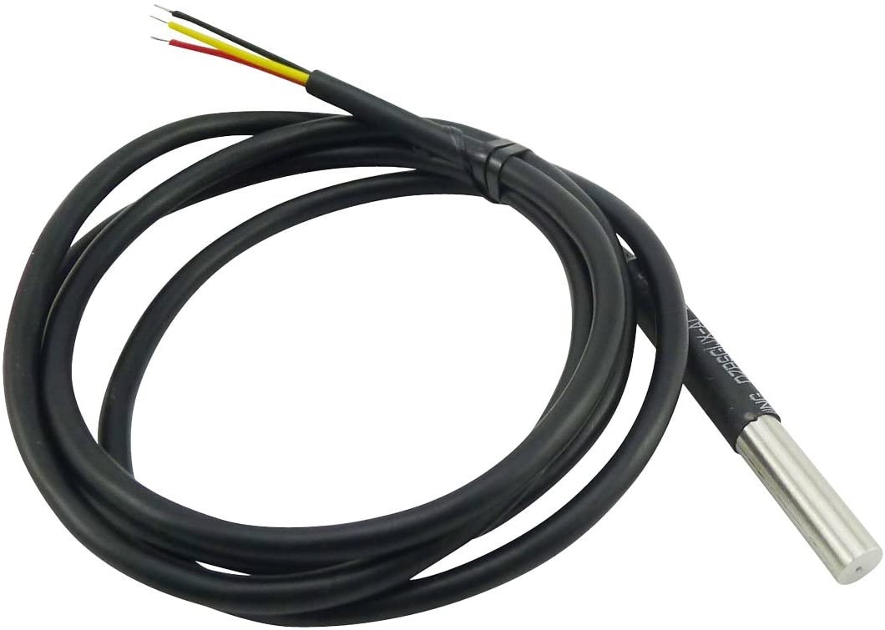
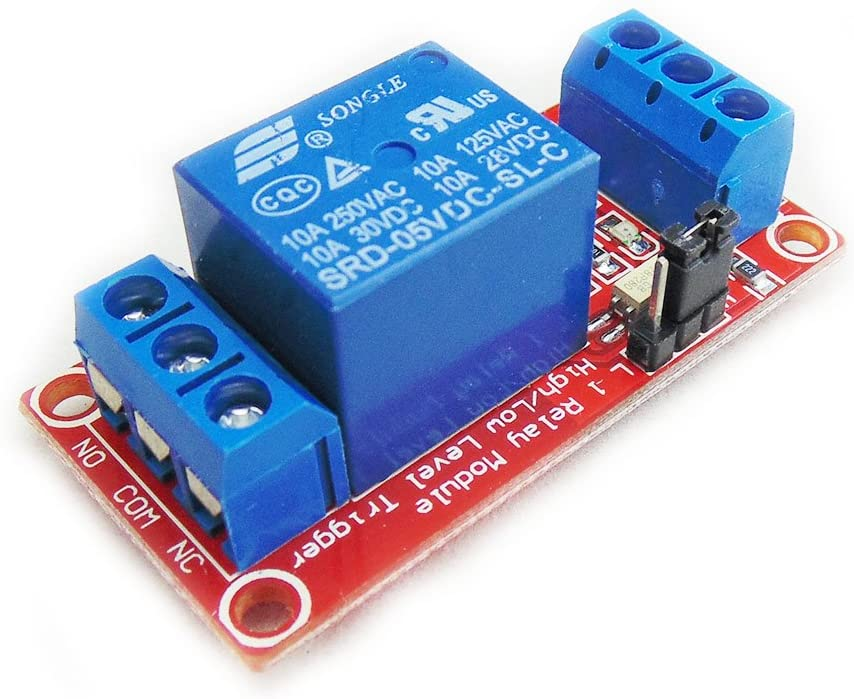

# Hydroponic 水耕栽培
This project was launched for Hydroponics.  
And the code in this project has been tested with MicroPython on ESP32 board.  

## Overview 概要
This project is MicroPython and is created by introducing PyMakr into Visual Studio Code.  
And the platform is ESP32 board, OLED SSD1306 for using to display the acquired informations, and other measuring device used are BME280 and DS18B20.  

The icon at startup is vertically, and the temperature display is in degrees Celsius.  
It is efficient to build a development environment to change.  
If the development environment has not been built, please build it while referring to the reference site or other.  

* Reference 参考  
    * [[備忘録]ESP32-VSCode-microPythonでの開発環境の構築 - Qiita](https://qiita.com/kotaproj/items/b53006aef9d04053a5ee) (Japanese)  

## Running Example 実行例

The following is an example of display while this project is running.  

```
[air]
T=18.3C H=53.56%
P=1019.45hPa
[water]
W=18.6C L=92.6%
....
```

The meaning of each item displayed is as follows.

| Classification | Display Item | Display Content | Unit |
| ---- | ---- | ---- | ---- |
| air | - | Atmosphere | - |
| ^ | T | Atmospheric Temperature | C, Degrees Celsius or F, Degrees Fahrenheit |
| ^ | H | Atmospheric Humidity | %, Percent |
| ^ | P | Atmospheric Pressure | hPa, Hectopascal |
| water | - | Liquid | - |
| ^ | W | Water Temperature | C, Degrees Celsius or F, Degrees Fahrenheit |
| ^ | L | Water Level | %, Percent |

## Hardware ハードウェア

### ESP32 board with OLED SSD1306
  
  

* Reference 参考  
  * [SSD1306 | Solomon Systech Limited](https://www.solomon-systech.com/en/product/advanced-display/oled-display-driver-ic/ssd1306/) (OFFICIAL English)  

OLED SSD1306 is OLED driver IC from SOLOMON SYSTECH.  
For this time used OLED is connected with I2C interface to the ESP32 board.  
The resolution is 128 x 64 and it is used as the display destination of the acquired informations.  

### BME280
  

* Reference 参考  
  * [Humidity Sensor BME280 | Bosch Sensortec](https://www.bosch-sensortec.com/products/environmental-sensors/humidity-sensors-bme280/) (OFFICIAL English)  
  * [BME280 – スイッチサイエンス](http://trac.switch-science.com/wiki/BME280) (Japanese)  

BME280 is a multi-function sensor from BOSCH that can measure temperature, humidity and atmospheric pressure.  
And it is connected with I2C interface.  

### DS18B20
  

* Reference 参考  
  * [DS18B20 Programmable Resolution 1-Wire Digital Thermometer - Maxim Integrated](https://www.maximintegrated.com/en/products/sensors/DS18B20.html/tb_tab0) (OFFICIAL English)  
  * [DS18B20 プログラマブル分解能1-Wireデジタルサーモメータ - Maxim Integrated](https://www.maximintegrated.com/jp/products/sensors/DS18B20.html) (OFFICIAL Japanse)  
  * [Interfacing the DS18X20/DS1822 1-Wire® Temperature Sensor in a Microcontroller Environment](https://www.maximintegrated.com/en/design/technical-documents/app-notes/1/162.html) (OFFICIAL English)  
  * [マイクロコントローラ環境における1-Wire&reg;温度センサDS18X20/DS1822とのインタフェース](https://www.maximintegrated.com/jp/design/technical-documents/app-notes/1/162.html) (OFFICIAL Japanese)  
  * [Quick reference for the ESP32 — MicroPython 1.13 documentation](http://docs.micropython.org/en/latest/esp32/quickref.html#onewire-driver) (English)  
  * [ESP32 用クイックリファレンス — MicroPython 1.13 ドキュメント](https://micropython-docs-ja.readthedocs.io/ja/latest/esp32/quickref.html#onewire-driver) (Japanese)  

DS18B20 is a thermistor device from Maxim.  
And it is connected with 1-Wire interface and uses a warterproof product.  

### Relay
  

* Reference 参考  
  * [5V 1ch Relay Module high/low level trigger](https://www.amazon.co.jp/gp/product/B0116IZ9FK/ref=ox_sc_saved_title_4?smid=A1XEAMF1H64GNM&psc=1) (Amazon)  

The relay is a component that receives an electric signal from the outside and turns on / off and switches the electric circuit.  
This time, it is used to switch the pump on / off by detecting the water level.  

## Installation 導入方法

This time, we will use esptool to the following steps.  

* Reference 参考  
  * [Getting started with MicroPython on the ESP32 — MicroPython 1.13 documentation](http://docs.micropython.org/en/latest/esp32/tutorial/intro.html) (OFFICIAL English)  
  * [ESP32 での MicroPython の始め方 — MicroPython 1.13 ドキュメント](https://micropython-docs-ja.readthedocs.io/ja/latest/esp32/tutorial/intro.html) (Japanese)  
  * [GitHub - espressif/esptool: Espressif SoC serial bootloader utility](https://github.com/espressif/esptool/) (English)  
  * [GitHub - scientifichackers/ampy: Adafruit MicroPython Tool - Utility to interact with a MicroPython board over a serial connection.](https://github.com/scientifichackers/ampy) (English)  
  * [ESP32でesptool.pyの使い方 – Lang-ship](https://lang-ship.com/blog/work/esp32-esptool-py/) (Japanese)  
  * [ampy: MicroPythonマイコンとPCとのファイル転送ツール – Ambient](https://ambidata.io/blog/2018/03/15/ampy/) (Japanese)  
  * [ESP32でMicroPython その2 (ampy) – Personal Tech Lab](https://personaltechlab.wordpress.com/2017/08/20/esp32%E3%81%A7micropython-%E3%81%9D%E3%81%AE2-ampy/) (Japanese)

### steps
1. Connect the ESP32 board and each devices.  
   Refer to following figure, you connect the devices according to the pin definition on the ESP32 board.  
     

   If the pin definition is different, you need to change settings in "hydroponic.json".  
   In addition, since the motor is connected instead of the water supply pump, please read it.  

1. Install the firmware of MicroPython to the ESP32 board  

    1. At first, you connect the ESP32 board and your PC with a MicroUSB Cable, and it is start to the following works.  

    1. Next, you download the firmware from MicroPython official download site.  
    [MicroPython - Python for microcontrollers](https://micropython.org/download/esp32/)  

    1. Next, you erase the flash memory on the ESP32 board.  
       Change connection port name and baud rate according to your environment.  
        ```bash
        esptool.py --chip esp32 --port COM3 --baud 921600 erase_flash
        ```

    1. Next, you put on the firmware of MicroPython to the ESP32 board.  
       This time, I used esp32-idf3-20200902-v1.13 for ESP-IDF v3.x as the firmware.  
        ```bash
        esptool.py --chip esp32 --port COM3 --baud 921600 write_flash 0x001000 esp32-idf3-20200902-v1.13.bin
        ```

1. Install this project files to the ESP32 board  

    1. At first, you download this project files from GitHub repository.  
        ```bash
        git clone https://github.com/ks-tec/hydroponic.git
        ```

    1. Next, you put on the download files to the ESP32 board.  
        ```bash
        cd hydroponic
        ampy --port COM3 mkdir lib
        ampy --port COM3 mkdir resource
        ampy --port COM3 put lib/bme280.py /lib/bme280.py
        ampy --port COM3 put lib/ds18.py /lib/ds18.py
        ampy --port COM3 put lib/relay.py /lib/relay.py
        ampy --port COM3 put lib/ssd1306.py /lib/ssd1306.py
        ampy --port COM3 put lib/util.py /lib/util.py
        ampy --port COM3 put lib/waterlevel.py /lib/waterlevel.py
        ampy --port COM3 put resource/splashicon.py /resource/splashicon.py
        ampy --port COM3 put main.py
        ampy --port COM3 put hydroponic.json
        ```

    1. Check put files, and there is no problem if it is as follows.
        ```bash
        ampy --port COM3 ls /
          /boot.py
          /hydroponic.json
          /lib
          /main.py
          /resource

        ampy --port COM3 ls /lib
          /lib/bme280.py
          /lib/ds18.py
          /lib/relay.py
          /lib/ssd1306.py
          /lib/util.py
          /lib/waterlevel.py

        ampy --port COM3 ls /resource
          /resource/splashicon.py
        ```

    1. Next, you run program on the ESP32 board.  
        ```bash
        ampy --port COM3 run main.py
        ```

## Settings 設定内容

| Group | Key | Value | Defalt Value | Unit |
| ---- | ---- | ---- | ---- | ---- |
| COMMON | SPLASH_ICON | vertical / horizontal / v / h | vertical | - |
| ^ | SPLASH_WAITING | splash icon display time | 3000 | msec |
| ^ | PLATFORM_WAITING | platform information display time | 2000 | msec |
| ^ | TEMPERATURE_UNIT | C or F | C | degrees celsius |
| OLED | PIN_SCL | SCL pin | 4 | - |
| ^ | PIN_SDA | SCL pin | 5 | - |
| ^ | ADDRESS | SSD1306 OLED address | "0x3c" | - |
| ^ | WIDTH | display width | 128 | dot |
| ^ | HEIGHT | display height | 64 | dot |
| ^ | DISPLAY_INTERVAL | display reflesh time | 9000 | msec |
| BME280 | PIN_SCL | SCL pin | 4 | - |
| ^ | PIN_SDA | SCL pin | 5 | - |
| ^ | ADDRESS | BME280 multi-function sensor address | "0x76" | - |
| DS18X20 | PIN_DQ | data pin | 16 | - |
| ^ | ADDRESS | DS18X20 thermistor address list | ["0x28", "0x82", "0x7d", "0x79", "0x97", "0x09", "0x03", "0x22"] | - |
| ^ | READING_WAIT | data reading wait time | 750 | msec |
| WATER_LEVEL | IS_ENABLE | true / false / yes / no / on / off / t / f / y / n / 1 / 0 | true | - |
| ^ | PIN_DQ | data pin | 14 | - |
| ^ | SENSE_MAX | max capacitive level | 375 | F |
| ^ | SENSE_MIN | min capacitive level | 230 | F |
| WATER_SUPPLY | IS_ENABLE | true / false / yes / no / on / off / t / f / y / n / 1 / 0 | true | - |
| ^ | PIN_DQ | data pin | 13 | - |
| ^ | SUPPLY_START | supply start water level | 20 | % |
| ^ | SUPPLY_FINISH | supply finish water level | 90 | % |
| ^ | DETECT_INTERVAL_ON | supply start capacitive level reading wait time | 5000 | msec |
| ^ | DETECT_INTERVAL_OFF | supply finish capacitive level reading wait time | 1000 | msec |

## Usage 使用方法
When you connect the ESP32 board to the power supply, the measurement starts automatically.  
Or, When you want restart, you rerun the program already placed on the ESP32 board.  

Change connection port name according to your environment.  

```bash
ampy --port COM3 run main.py
```

## What has been and will be これまでのこと、これからのこと
I am NOT good at Python language, but rather just getting started and having fun learning.  
Still, I have made it this far.  

It supports simple capacitive water level detection using a touch pin.  
And, it also supports automatic water supply through relay control that accompanies water level detection.  

Ultimately, I aim for all-weather hydroponics using LED lights.  

## Note 注意事項
The contents of this project may be updated without notice. Please be aware.  

## License ライセンス
This project is under [MIT license](https://en.wikipedia.org/wiki/MIT_License).  
Copyright (c) 2020, [ks-tec](https://github.com/ks-tec/).  
