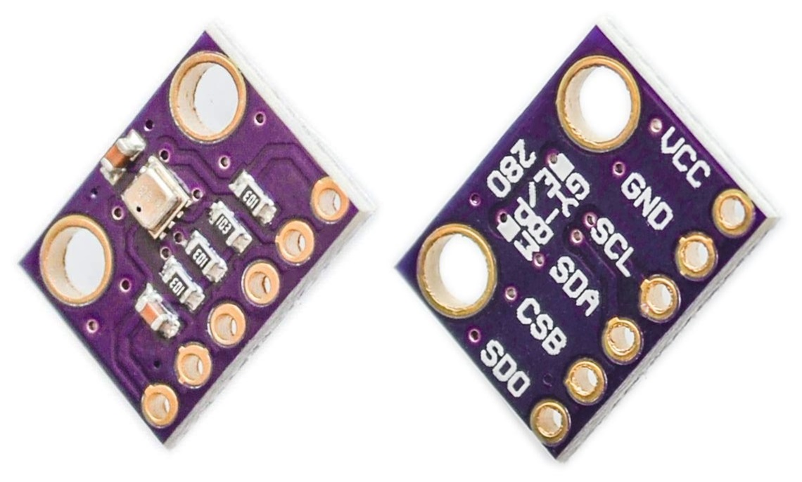

# Hydroponic 水耕栽培
このプロジェクトは、水耕栽培用に立ち上げたものです。  
また、プロジェクト動作確認は ESP32 ボード上の MicroPython で行いました。  

## Overview 概要
このプロジェクトは MycroPython で Visual Studio Code に PyMakr を導入して作成しています。  
プラットフォームは ESP32 ボードで、取得したデータ表示に SSD1306 を使用し、その他の計測デバイスは BME280 と DS18B20 です。  

起動時のアイコン表示は縦方向、温度は摂氏表示、となっています。  
これを変更するには、開発環境を構築すると効率的です。  
もし開発環境が未構築の場合は、Web サイト等を参照しながら構築してみてください。  

* Reference 参考  
    * [[備忘録]ESP32-VSCode-microPythonでの開発環境の構築 - Qiita](https://qiita.com/kotaproj/items/b53006aef9d04053a5ee) (Japanese)  

## Running Example 実行例
このプロジェクトの実行中の画面表示例です。  

```
[air]
T=18.3C H=53.56%
P=1019.45hPa
[water]
W=18.6C L=92.6%
....
```

画面に表示される各項目が意味するものは、以下のとおりです。  

| 分類 | 項目 | 表示内容 | 単位 |
| ---- | ---- | ---- | ---- |
| air | - | 大気 | - |
| ^ | T | 気温 | C, Celsius |
| ^ | H | 湿度 | %, Percent |
| ^ | P | 気圧 | hPa, Hectopascal |
| water | - | 液体 | - |
| ^ | W | 液体温度 | C, Celsius |
| ^ | L | 液面レベル | %, Percent |

## Hardware ハードウェア

### ESP32 board with OLED SSD1306
  
  

* Reference 参考  
  * [SSD1306 | Solomon Systech Limited](https://www.solomon-systech.com/en/product/advanced-display/oled-display-driver-ic/ssd1306/) (OFFICIAL English)  

OLED SSD1306 は SOLOMON SYSTECH 社が提供する OLED ドライバです。  
今回の OLED は ESP32 ボードに I2C インターフェースで接続している ESP32 ボードです。  
また解像度が 128 x 64 で、取得した情報の表示先として使用しています。  

### BME280
  

* Reference 参考  
  * [Humidity Sensor BME280 | Bosch Sensortec](https://www.bosch-sensortec.com/products/environmental-sensors/humidity-sensors-bme280/) (OFFICIAL English)  
  * [BME280 – スイッチサイエンス](http://trac.switch-science.com/wiki/BME280) (Japanese)  

BME280 は BOSCH 社が提供する多機能センサーで 温度・湿度・大気圧 を計測できるマルチセンサーです。  
I2C インターフェースで接続しています。  

### DS18B20
  

* Reference 参考  
  * [DS18B20 Programmable Resolution 1-Wire Digital Thermometer - Maxim Integrated](https://www.maximintegrated.com/en/products/sensors/DS18B20.html/tb_tab0) (OFFICIAL English)  
  * [DS18B20 プログラマブル分解能1-Wireデジタルサーモメータ - Maxim Integrated](https://www.maximintegrated.com/jp/products/sensors/DS18B20.html) (OFFICIAL Japanse)  
  * [Interfacing the DS18X20/DS1822 1-Wire® Temperature Sensor in a Microcontroller Environment](https://www.maximintegrated.com/en/design/technical-documents/app-notes/1/162.html) (OFFICIAL English)  
  * [マイクロコントローラ環境における1-Wire&reg;温度センサDS18X20/DS1822とのインタフェース](https://www.maximintegrated.com/jp/design/technical-documents/app-notes/1/162.html) (OFFICIAL Japanese)  
  * [Quick reference for the ESP32 — MicroPython 1.13 documentation](http://docs.micropython.org/en/latest/esp32/quickref.html#onewire-driver) (English)  
  * [ESP32 用クイックリファレンス — MicroPython 1.13 ドキュメント](https://micropython-docs-ja.readthedocs.io/ja/latest/esp32/quickref.html#onewire-driver) (Japanese)  

DS18B20 は MAXIM 社が提供するサーミスタデバイスです。  
1-Wire インターフェースで接続しており、防水された製品を使用しています。  

### Relay
  

* Reference 参考  
  * [5V 1ch Relay Module high/low level trigger](https://www.amazon.co.jp/gp/product/B0116IZ9FK/ref=ox_sc_saved_title_4?smid=A1XEAMF1H64GNM&psc=1) (Amazon)  

リレーとは外部から電気信号を受け取り、電気回路のオン/オフや切り替えを行う部品です。  
今回は水位検知によるポンプのオン/オフを切り替えるために使います。  

## Installation 導入方法
ここでは、esptool と ampy を使った導入手順を例示します。  

* Reference 参考  
  * [Getting started with MicroPython on the ESP32 — MicroPython 1.13 documentation](http://docs.micropython.org/en/latest/esp32/tutorial/intro.html) (OFFICIAL English)  
  * [ESP32 での MicroPython の始め方 — MicroPython 1.13 ドキュメント](https://micropython-docs-ja.readthedocs.io/ja/latest/esp32/tutorial/intro.html) (Japanese)  
  * [GitHub - espressif/esptool: Espressif SoC serial bootloader utility](https://github.com/espressif/esptool/) (English)  
  * [GitHub - scientifichackers/ampy: Adafruit MicroPython Tool - Utility to interact with a MicroPython board over a serial connection.](https://github.com/scientifichackers/ampy) (English)  
  * [ESP32でesptool.pyの使い方 – Lang-ship](https://lang-ship.com/blog/work/esp32-esptool-py/) (Japanese)  
  * [ampy: MicroPythonマイコンとPCとのファイル転送ツール – Ambient](https://ambidata.io/blog/2018/03/15/ampy/) (Japanese)  
  * [ESP32でMicroPython その2 (ampy) – Personal Tech Lab](https://personaltechlab.wordpress.com/2017/08/20/esp32%E3%81%A7micropython-%E3%81%9D%E3%81%AE2-ampy/) (Japanese)

#### 導入手順
1. ESP32 ボードと各デバイスを配線します。  
   下図を参考に、ESP32 ボードのピン定義に合わせて接続してください。  
     

   ESP32 ボードのピン定義が異なる場合は、設定ファイル "hydroponic.json" の変更が必要になります。  
   なお、給水ポンプの代わりにモーターを繋いでいますので、読み替えてください。  

1. MicroPython を導入します。  

    1. ESP32 ボードと PC を MicroUSB ケーブルで繋いだら、作業を開始します。  

    1. MicroPython 公式サイトからファームウェアをダウンロードします。  
    [MicroPython - Python for microcontrollers](https://micropython.org/download/esp32/)  

    1. ESP32 ボード上のフラッシュを消去します。  
       接続されているポート番号やボーレートは、環境に合わせて変更してください。
        ```bash
        esptool.py --chip esp32 --port COM3 --baud 921600 erase_flash
        ```

    1. ESP32 ボードに MicroPython のファームウェアを書き込みます。  
       今回は ファームウェアに ESP-IDF v3.x 向けの esp32-idf3-20200902-v1.13 を使いました。  
        ```bash
        esptool.py --chip esp32 --port COM3 --baud 921600 write_flash 0x001000 esp32-idf3-20200902-v1.13.bin
        ```

1. このプロジェクトを導入します。  

    1. GitHub からダウンロードします。  
        ```bash
        git clone https://github.com/ks-tec/hydroponic.git
        ```

    1. ESP32 ボードに このプロジェクトを書き込みます。  
        ```bash
        cd hydroponic
        ampy --port COM3 mkdir lib
        ampy --port COM3 mkdir resource
        ampy --port COM3 put lib/bme280.py /lib/bme280.py
        ampy --port COM3 put lib/ds18.py /lib/ds18.py
        ampy --port COM3 put lib/relay.py /lib/relay.py
        ampy --port COM3 put lib/ssd1306.py /lib/ssd1306.py
        ampy --port COM3 put lib/util.py /lib/util.py
        ampy --port COM3 put lib/waterlevel.py /lib/waterlevel.py
        ampy --port COM3 put resource/splashicon.py /resource/splashicon.py
        ampy --port COM3 put main.py
        ampy --port COM3 put hydroponic.json
        ```

    1. 配置したファイル群を確認して、以下のようになっていれば問題ありません。  
        ```bash
        ampy --port COM3 ls /
          /boot.py
          /hydroponic.json
          /lib
          /main.py
          /resource

        ampy --port COM3 ls /lib
          /lib/bme280.py
          /lib/ds18.py
          /lib/relay.py
          /lib/ssd1306.py
          /lib/util.py
          /lib/waterlevel.py

        ampy --port COM3 ls /resource
          /resource/splashicon.py
        ```

    1. ESP32 ボード上でプロジェクトを実行します。
        ```bash
        ampy --port COM3 run main.py
        ```

## Settings 設定内容

| Group | Key | Value | Defalt Value | Unit |
| ---- | ---- | ---- | ---- | ---- |
| COMMON | SPLASH_ICON | vertical / horizontal / v / h | vertical | - |
| ^ | SPLASH_WAITING | splash icon display time | 3000 | msec |
| ^ | PLATFORM_WAITING | platform information display time | 2000 | msec |
| OLED | PIN_SCL | SCL pin | 4 | - |
| ^ | PIN_SDA | SCL pin | 5 | - |
| ^ | ADDRESS | SSD1306 OLED address | "0x3c" | - |
| ^ | WIDTH | display width | 128 | dot |
| ^ | HEIGHT | display height | 64 | dot |
| ^ | DISPLAY_INTERVAL | display reflesh time | 9000 | msec |
| BME280 | PIN_SCL | SCL pin | 4 | - |
| ^ | PIN_SDA | SCL pin | 5 | - |
| ^ | ADDRESS | BME280 multi-function sensor address | "0x76" | - |
| DS18X20 | PIN_DQ | data pin | 16 | - |
| ^ | ADDRESS | DS18X20 thermistor address list | ["0x28", "0x82", "0x7d", "0x79", "0x97", "0x09", "0x03", "0x22"] | - |
| ^ | READING_WAIT | data reading wait time | 750 | msec |
| WATER_LEVEL | IS_ENABLE | true / false / yes / no / on / off / t / f / y / n / 1 / 0 | true | - |
| ^ | PIN_DQ | data pin | 14 | - |
| ^ | SENSE_MAX | max capacitive level | 375 | F |
| ^ | SENSE_MIN | min capacitive level | 230 | F |
| WATER_SUPPLY | IS_ENABLE | true / false / yes / no / on / off / t / f / y / n / 1 / 0 | true | - |
| ^ | PIN_DQ | data pin | 13 | - |
| ^ | SUPPLY_START | supply start water level | 20 | % |
| ^ | SUPPLY_FINISH | supply finish water level | 90 | % |
| ^ | DETECT_INTERVAL_ON | supply start capacitive level reading wait time | 5000 | msec |
| ^ | DETECT_INTERVAL_OFF | supply finish capacitive level reading wait time | 1000 | msec |

## Usage 使用方法
ESP32 ボードと電源を繋ぐと、自動的に計測が始まります。  
または、再起動したい場合は、ESP32 ボード上に配置済みのプログラムを再実行します。  

接続されているポート番号は、環境に合わせて変更してください。  

```bash
ampy --port COM3 run main.py
```

## What has been and will be これまでのこと、これからのこと
私は Python が得意ではなく、むしろ触れ始めたばかりで楽しみながら学んでいるところす。  
それでも、ここまで進んで来られました。

タッチピンを使用して簡易的なな静電容量方式の水位検出に対応しています。  
そして、水位検出に伴うリレー制御を通じた自動給水にも対応しています。  

最終的には、LED 光を利用した全天候型の水耕栽培を目指しています。  

## Note 注意事項
このプロジェクトの内容は、予告なく更新される場合があります。 ご承知おきください。  

## License ライセンス
This project is under [MIT license](https://en.wikipedia.org/wiki/MIT_License).  
Copyright (c) 2020, [ks-tec](https://github.com/ks-tec/).  
